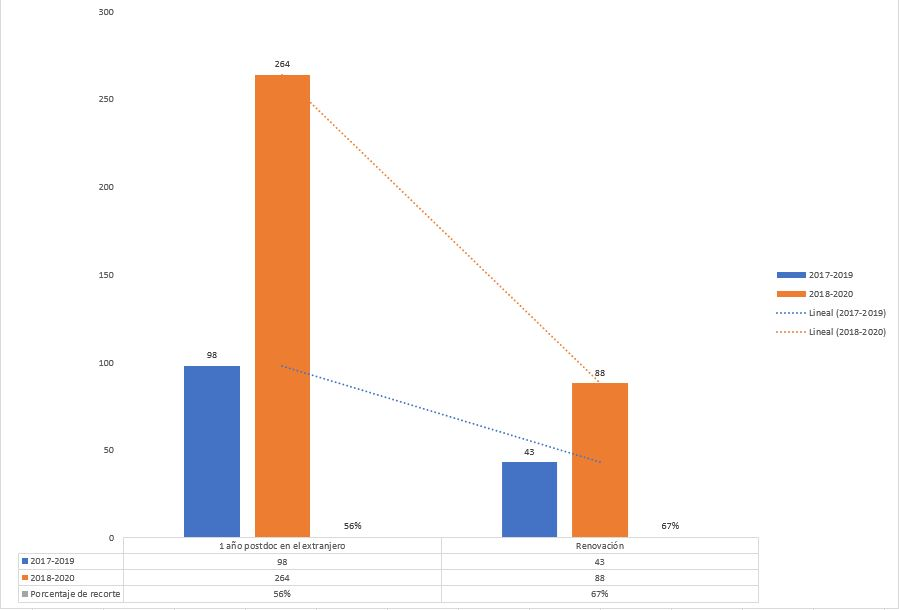

## Irregularidades en los criterios de evaluación por parte de CONACyT deja sin recursos a más del 60% de los investigadores postdoctorales en el extranjero

Por medio del presente comunicado, queremos hacer del conocimiento de la sociedad en su conjunto y a la comunidad científica mexicana los criterios empleados por la actual administración del Consejo Nacional de Ciencia y Tecnología (CONACyT) para recortar **el número de renovación de becas para estancias posdoctorales en el extranjero Vinculadas a la Consolidación de Grupos de Investigación y Fortalecimiento del Posgrado Nacional, año 2**.

Durante el año 2018 se asignaron 260 becas de primer año para proyectos postdoctorales en el extranjero. Este año se renovaron únicamente 88 proyectos para su continuidad. **El criterio de peso no fue científico, ni se tomó en cuenta la pertinencia para el desarrollo del país ni las propuestas de colaboración internacional entre instituciones nacionales y extranjeras**. Muchos aspirantes cuyas propuestas no fueron aceptadas fuimos notificados de que el motivo por el que fue descartada nuestra solicitud se debió a _la falta de la identificación del investigador anfitrión_. 

Alrededor de 30 de los afectados analizamos cómo era posible que un número tan elevado de investigadores hubiéramos cometido ese error. Al revisar toda la documentación se hizo evidente que fue consecuencia de una serie de omisiones e incosistencias en los lineamientos, guía y plataforma de captura por parte de los responsables de emitir la convocatoria. Con muy poco profesionalismo, se intentó subsanar todo esto con una nota al calce (en lugar de corregir la plataforma, o emitir un comunicado oficial). A pesar de que CONACyT acepta su error en la plataforma mantiene su dicho de culpar a los becarios de no enviar un documento entre tanta inconsistencia y confusión (documento que, por otra parte, se encuentra disponible en la plataforma como parte de los requisitos del primer año).

Aunado a esto y en busca de respuestas y casos similares (ya que los resultados no son de información pública). Se encontraron más investigadores cuyas solicitudes fueron desestimadas por razones tan absurdas como errores tipográficos u omisiones en el porcentaje de avance. Porcentajes que se perciben rápidamente al leer el informe detallado de avances (obligación del comité evaluador) y donde es claro que estos superan el porcentaje mínimo requerido por el Conacyt. 

**Es importante mencionar que el CONACyT habilita su plataforma oficial para recopilar la información de cada aspirante y que dicha plataforma presenta fallas constantemente, las cuales entorpecen la integración de los requisitos demandados. Por ello los aspirantes intentamos seguir los lineamientos y guías previamente publicadas.** 

En conjunto, los afectados redactamos una carta dirigida a la **Dra. María Elena Álvarez-Buylla Roces**,al **Dr. Mario Andrés De Leo Winkler** y a la **Lic. Irma Lucía Reyes Balleza**, solicitando que se nos permitiera subsanar los errores de captura derivados de las inconsistencias en su plataforma **y exhortando a los funcionarios del CONACyT que nuestras propuestas fueran evaluadas con base a su calidad, pertinencia, viabilidad del programa de trabajo, metas y productos finales correspondientes a la propuesta para el 2do año de estancia postdoctoral**. 

En respuesta, recibimos el oficio E2000/080/19 firmado por el **Dr. Mario Andrés De Leo Winkler**, en donde CONACyT acepta que modificó las condiciones y requisitos establecidos en la Convocatoria realizando cambios al aplicativo informático añadiendo una nota al calce en la ventana de documentos requeridos en una **fecha posterior a la apertura de la convocatoria**, sin embargo, en dicho oficio ratifican el dictamen previamente emitido que a la letra dice: _“Su solicitud se encuentra incompleta, motivo por el cual no fue considerada dentro del proceso de asignación de becas establecidos en la Convocatoria y sus Términos de Referencia”_.

El recorte presupuestal correspondiente a este y otros programas de becas en CONACyT pretende ser maquillado de manera insultante para nuestra trayectoria científica. Nos resulta decepcionante que los recursos invertidos por la nación durante el primer año se pierdan por detalles tan vanos. Esta decisión deja proyectos de alto impacto (justificables y comprobables) a medias, además de fracturar los convenios y lazos de colaboración establecidos con universidades y centros de investigación de gran prestigio a nivel mundial. 

En nuestra opinión, CONACyT ha violado su propia reglamentación interna (publicado en el Diario Oficial de la Federación del 16 de febrero del 2018) al impedir la presentación correcta de renovación para los proyectos de investigación. Todo pareciera apuntar a que se recurrió a prácticas engañosas de descalificación para no renovar los apoyos económicos a un gran número de investigaciones, consideradas relevantes en un principio.

No somos adversarios políticos, ni somos miembros activos de partidos con intereses ocultos. Somos investigadores mexicanos que pasamos los filtros más estrictos, con proyectos de gran calidad, para poder ser aceptados en la convocatoria de estancias posdoctorales en el extranjero año 1. Somos personas que buscamos el progreso de nuestro país a través de la ciencia. Nuestras investigaciones no son menores, entre el grupo de afectados nos encontramos investigadores que buscamos soluciones a graves enfermedades como el cáncer y la epilepsia; la solución a enfermedades comunes que afectan la salud pública. Se realizan investigaciones que buscan un mundo y un México más sostenible, como la evaluación y pertinencia del tren Maya como ruta cultural, por mencionar sólo algunas.

Por todo lo anteriormente expuesto solicitamos la intervención del presidente **Andrés Manuel López Obrador** y al Secretario de Educación Pública **Esteban Moctezuma Barragán**, para una revisión, entre pares, minuciosa, objetiva y sin represalias de nuestro caso. Que se evalúen nuestras propuestas conforme a los criterios establecidos: **cumplimiento de compromisos, relevancia y pertinencia para entender la realidad nacional**.

Ante una gran impotencia y decepción de la política en materia científica de la actual administración del gobierno federal, exponemos a ustedes nuestro caso solicitando su apoyo para su difusión con el objetivo de obtener una respuesta y resolución a la problemática que estamos viviendo cientos de investigadores mexicanos en diferentes partes del mundo. Esperamos que la exposición de nuestra situación ayude en un futuro corto a toda la comunidad científica que trabaja siempre por el progreso de nuestro país. 

## Fuentes

+ [Convocatoria 2018](https://www.conacyt.gob.mx/index.php/el-conacyt/convocatorias-y-resultados-conacyt/convocatorias-estancias-posdoctorales-sabaticas-extranjero-1/conv-epe-gest-18)

+ [Convocatoria 2019](https://www.conacyt.gob.mx/index.php/el-conacyt/convocatorias-y-resultados-conacyt/convocatorias-estancias-posdoctorales-sabaticas-extranjero-1/conv-epe-19)

## Firmantes

+ Dr. Raúl Uziel Espinal Bustos (171768)
+ Dra. Nelly Arcos Martínez (249770)
+ Dra. Rosa Maria Vargas Magaña (253734)	 
+ Dra. Marcela Martín del Campo Fierro (302493)
+ Dra. María Abigail Jiménez Franco (350809)	
+ Dra. Mariana Patricia Cervantes Silva (440823)
+ Dra. Adriana Azucena Cortés Gómez (399405) 	
+ Dr. Francisco Javier Rivera Paleo (447684)
+ Dr. Alejandro Enríquez Cabrera (442797)	
+ Dra. Julie Eliene Hernández Salmerón (288058)
+ Dr. Silver-Hamill Turren-Cruz (459795)	
+ Dra. María Fernanda Pérez Bernal (419307)
+ Dr. Alonso Moreno Zuria (485222)	 
+ Dr. Carlos Rodrigo Guzmán Durán (210595)
+ Dr. Francisco Cuellar Pérez	 
+ Dr. Adán José-García (368117)
+ Dra. Abril Armenta Franco (373438)
+ Dr. Eric Eugenio López (289891)
+ Dra. Ireri Betsabe Franco Estrada (371096)
