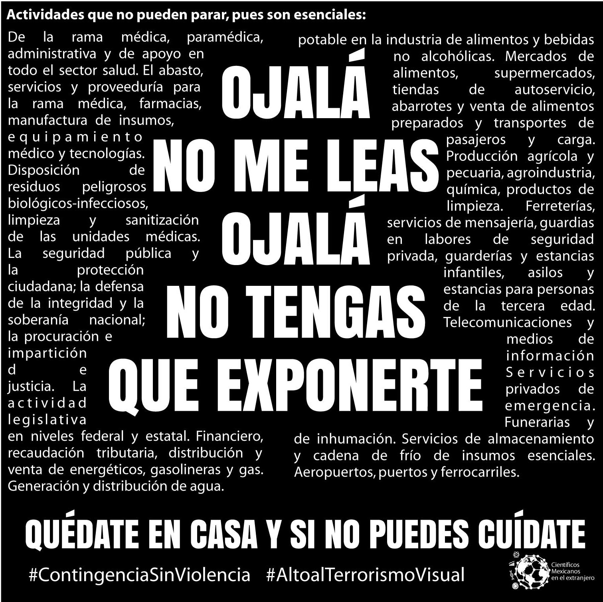
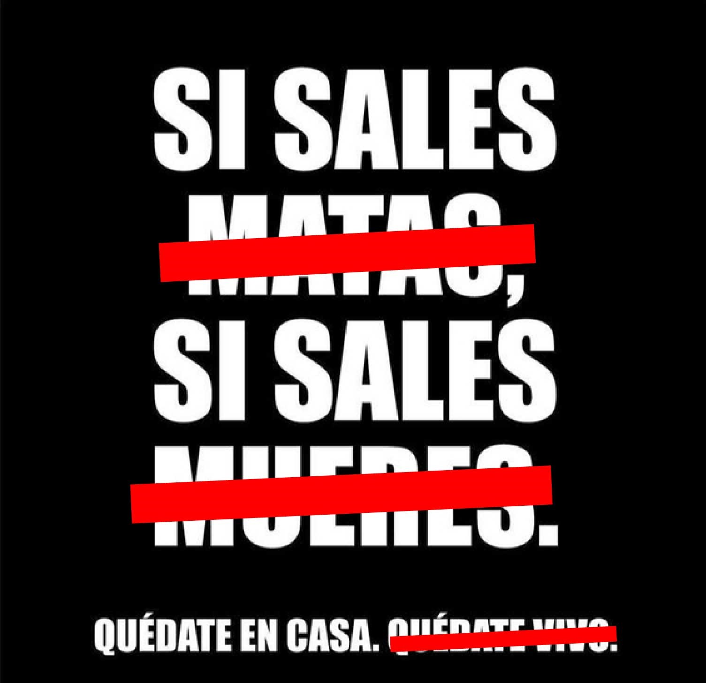
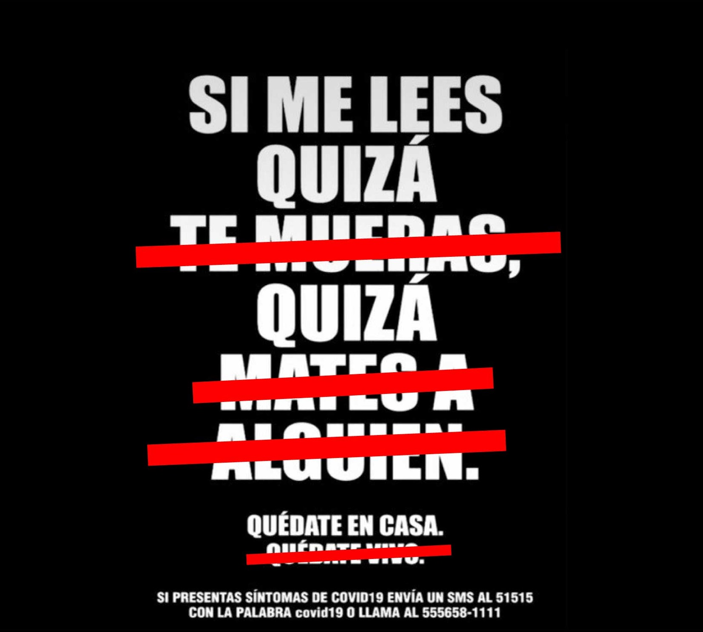
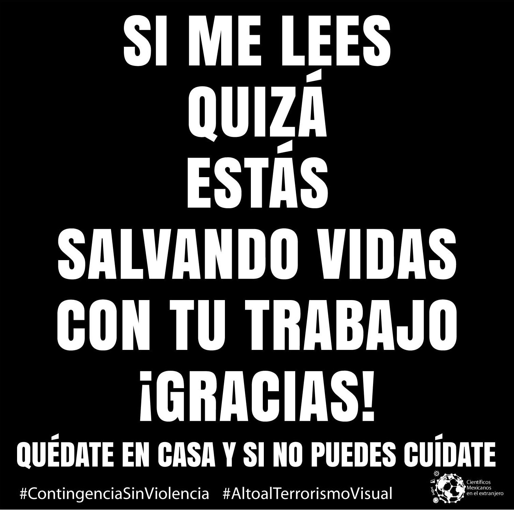
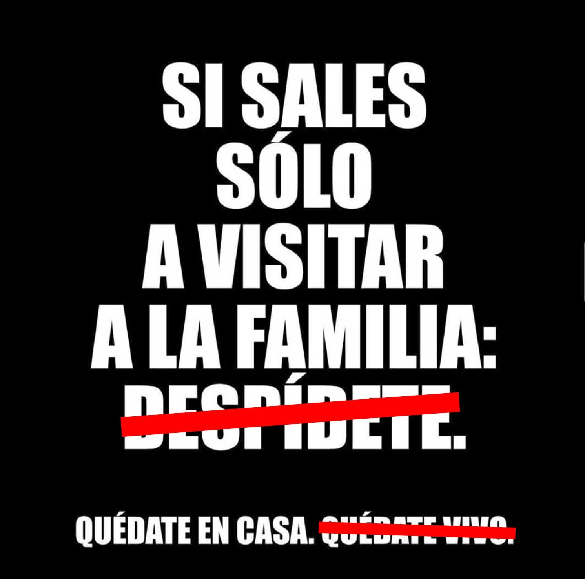
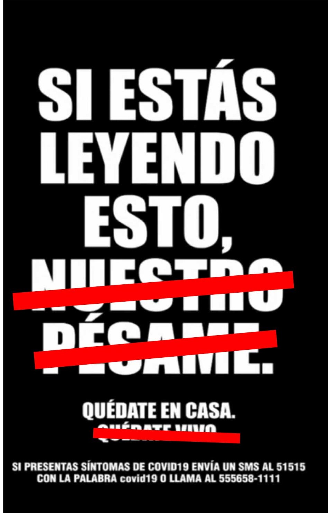
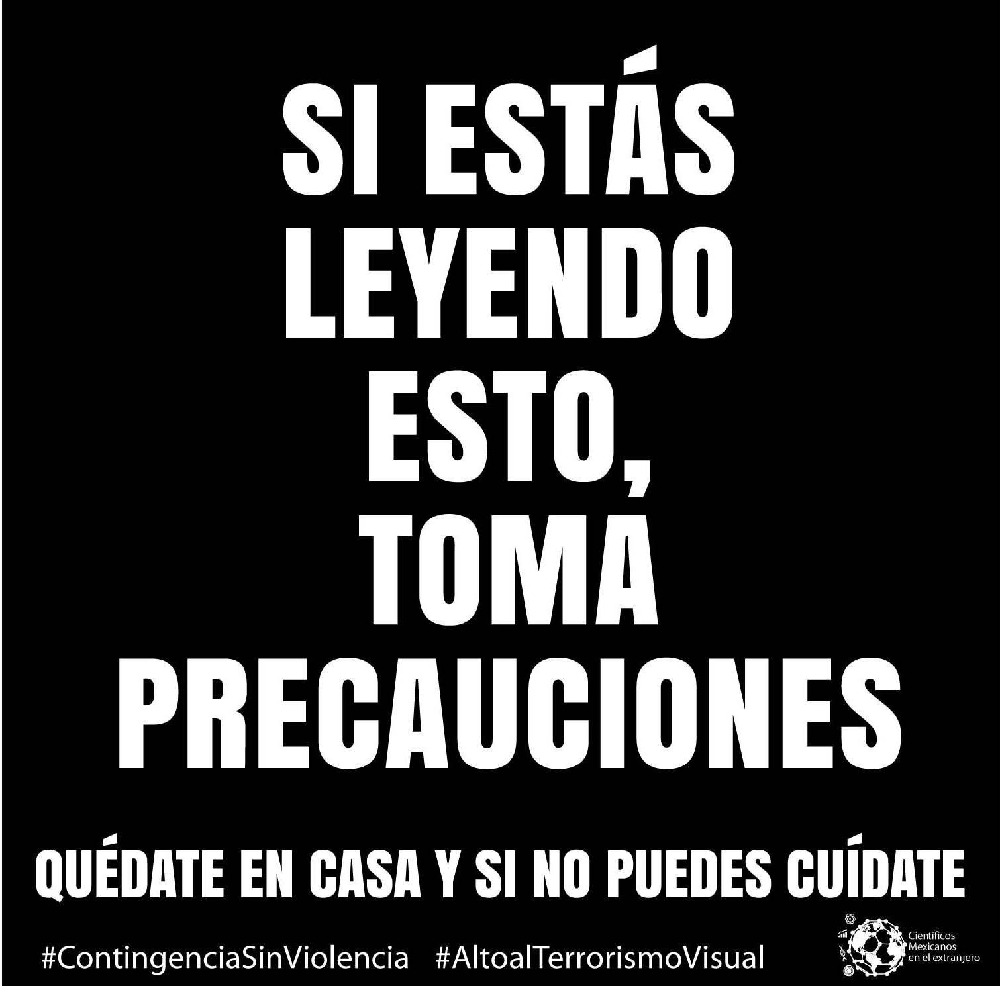
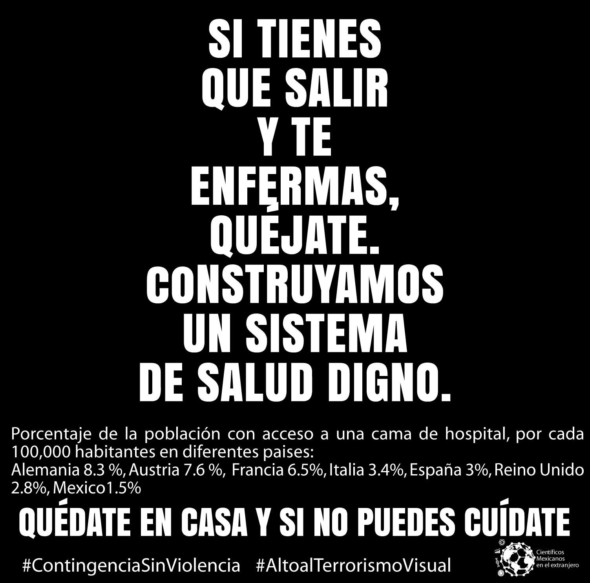

Creemos que la campaña lanzada por el grupo Alianza por el Valor Estratégico de las marcas no es solidaria ni empática. Hemos propuesto una contracampaña para la realidad de México.

1. Salir no significa la muerte pero sí representa un riesgo que muchas personas tienen que correr porque realizan trabajos esenciales. Sólo hay que tomar precauciones. Cuídate.

<figure class="half" style="display:flex">
    
    
</figure>

2. Salir no significa morir, mucho menos matar. Pero estamos en la fase 3 de la epidemia que significa mayor contagio. Guarda tu sana distancia y no salgas innecesariamente.

<figure class="half" style="display:flex">
    
    
</figure>

3. Sabemos que estar en casa a veces no es fácil. Estamos en la fase 3 de epidemia. Si tienes que salir de casa, sigue las recomendaciones de la secretaría de salud para evitar contagios.

<figure class="half" style="display:flex">
    
    
</figure>

4. Para todos los trabajadores invisibilizados que sostienen a México en vialidades, instituciones, servicio de recolección de residuos, distribución de alimentos y agua potable... ¡Gracias!

<figure class="half" style="display:flex">
    
    
</figure>

5. No todos están seguros en casa. Según datos del SESNSP, en marzo del 2020 las denuncias por violencia familiar alcanzaron la cifra más alta registrada en México desde el 2015.

<figure class="half" style="display:flex">
    
    
</figure>

6. No abandones a los adultos mayores. Muchos de ellos necesitan tu ayuda. Conserva tu sana distancia y sigue las recomendaciones de la secretaría de salud.

<figure class="half" style="display:flex">
    
    
</figure>

7. Rechazamos el miedo como estrategia para enfrentar la crisis sanitaria. La salud mental de la población es igual de importante que su salud física. Queremos una sociedad solidaria, no amedrentada.

<figure class="half" style="display:flex">
    
    
</figure>

8. México solamente tiene 150 camas de hospital por cada 100,000 habitantes. Quéjate. Juntos podemos luchar por un sistema de salud que le brinde atención médica de calidad a todas y a todos.

<figure class="half" style="display:flex">
    
    
</figure>

9. Cuídate. Cuidémonos entre todos. Desde este colectivo nos pronunciamos contra el miedo y la agresión como agentes de cambio. Intentemos la solidaridad y la empatía como forma de vida.

<figure class="half" style="display:flex">
    
    
</figure>