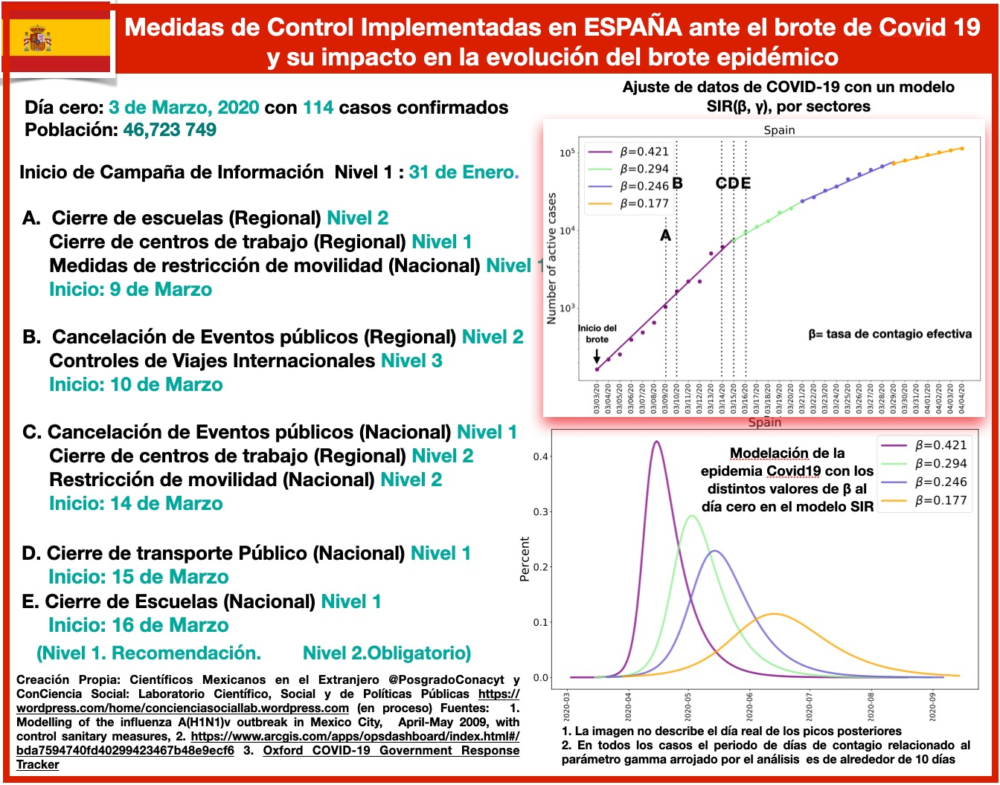

## Presentación e intención

Esta es una iniciativa que busca ofrecer una herramienta confiable a la sociedad sobre el escenario de México frente a la contingencia del COVID-19 y el impacto de las medidas de control implementadas por la Secretaría de Salud con apoyo del Gobierno para mitigar el brote epidémico. 

Por medio de un modelo matemático y una metodología de análisis, buscamos sumar esfuerzos a las iniciativas llevadas a cabo por el Gobierno de México a través de la Secretaría de Salud para poder informar y transmitir a la población la relevancia de atender y seguir ejemplarmente las medidas de control para contener y mitigar el brote epidémico COVID-19 en el país.

Así mismo declaramos que lejos de  intereses particulares y afiliaciones políticas, nuestro compromiso y responsabilidad es con la sociedad mexicana.

## ¿Quienes somos?

Somos dos grupos que trabajamos en colaboración, el colectivo de [Científicos Mexicanos en el extranjero](http://postdoconacyt.github.io/) 
y  el grupo  [ConCiencia Social: Laboratorio Científico, Social y de Políticas Públicas](https://concienciasociallab.wordpress.com/) (ver miembros al final de la nota). Conformamos un grupo multidisciplinario que nos encontramos en diferentes países, por supuesto México, España, Reino Unido, Portugal, Austria, Italia, Francia y Estados Unidos de América (EUA).

## Contexto

Estamos viviendo una pandemia provocada por el virus COVID-19  cuyo primer brote se detectó en la provincia de Hubei en China, marcando el día cero de este brote por un nuevo coronavirus el día 19 de enero de 2020 con 216 infectados. Desde entonces el virus COVID-19 se ha propagado a nivel internacional lo que ha ocasionado que al día de hoy se tengan registrado brotes de COVID-19 en 178 países. La  intensidad y evolución de cada brote epidémico ha variado en cada localidad  como lo manifiestan las curvas de infectados, recuperados y defunciones, que podemos consultar en la red de forma actualizada y confiable como lo es el repositorio [de la universidad Johns Hopkins University](https://github.com/CSSEGISandData/COVID-19/blob/master/csse_covid_19_data/csse_covid_19_time_series/time_series_covid19_confirmed_global.csv). Además de múltiples bases de datos disponibles, en partular la que usamos para este trabajo sobre las medidas de control que los diversos gobiernos han implementado con fechas actualizadas y que es elaborada por la universidad de Oxford -- [Oxford COVID-19 Government Response Tracker]((https://www.bsg.ox.ac.uk/research/research-projects/oxford-covid-19-government-response-tracker)).

## Planteamiento original  y motivación

Hemos seguido de cerca y experimentado directamente las medidas de control que han sido implementadas en los diferentes países en donde nos encontramos además de haber analizado el caso de China y podemos percatarnos de los diferentes binomios (medidas de control, mitigación del brote) que han sido implementados con mayor o menor éxito en los distintos países. 

El planteamiento que nos hicimos fue analizar la viabilidad de implementar  un modelo matemático y una metodología que nos permitiera dar pautas a la sociedad mexicana en estos momentos y responder con base en parámetros medibles si estas medidas son útiles y eficientes para contener y mitigar el brote epidémico. Resultando que nuestro modelo es capaz de responder un con un contundente SÍ, las medidas de control diseñadas e implementadas en este momento y en este estadio de la epidemia si tuvieron y tendrán un efecto en el periodo de la evolución del brote epidémico. 

## Concretamente nuestros objetivos son:

- Mostrar comportamiento decreciente de la tasa de contagio efectiva medida en los diferentes países analizados después de un periodo de haber aplicado las medidas de control.
- Mostrar que la efectividad de estas medidas depende tanto del orden y la temporalidad dentro de las etapas del brote, así como de la severidad con las que fueron aplicadas y la duración de las mismas.
- Resaltar que la elaboración de una estrategia adecuada a cada país para la implementación de estas medidas es crucial para la contención y mitigación del brote epidémico.

## Modelo matemático SIR 

La base de este trabajo es un modelo clásico de 1927 ideado por los médicos escoceses W. O. Kermack y A. G. McKendrick, el cual emplea un sistema de ecuaciones diferenciales a fin de detallar cómo surge un brote infeccioso, su crecimiento, en qué momento alcanza su máximo y cómo después decae, todo ello a partir de dos parámetros: uno biológico ``\gamma`` y otro social ``\beta``:

- Parámetro ``\gamma``:
Es un parámetro biológico que está relacionado con el número de días en que tarda un humano infectado en recuperarse y es contagioso. 

- Parámetro ``\beta``:
Es un parámetro social que considera cómo se transmite el COVID-19 y cómo puedes disminuir su contagio implementando medidas de control de diferente corte que ayuden a modificar y limitar la interacción entre humanos.

Estas medidas son de una gama muy amplia que van desde medidas que no frenan la actividad laboral y social en las ciudades, como por ejemplo: incluir hábitos higiénicos como el lavado de manos y el no tocarse la cara, la limpieza de superficies y hábitos de interacción social como  la sana distancia entre las personas, hasta las medidas más restrictivas y severas que impactan en el desarrollo laboral y de restricciones en la movilidad de la sociedad, como por ejemplo lo es el aislamiento en determinados casos, hacer home office, entre otras y las que se incluyen en una etapa más avanzada de la epidemia como por ejemplo:  cierre de centros de trabajo no esenciales y cuarentena prolongada.  Además, dentro de esta gama de medidas están las de corte monetario y fiscal  que son muy necesarias en un brote de larga duración para proteger a la población más desprotegida. Recordemos que México es un país que debe enfrentar la Contingencia Covid-19 en las condiciones adversas con el 50% de su población en la pobreza, no bancarizada y con un sistema de salud precario.

El modelo depende igualmente de la población total, y de ciertos valores iniciales que son el número inicial de infectados, de defunciones y de recuperados al día cero del brote. El modelo predice el número de personas infectadas y recuperados a diferentes tiempos.

El modelo anterior también conocido como modelo SIR es adecuado para analizar este tipo de brotes epidémicos ya que describe a un buen nivel de precisión la evolución de un brote provocado por un nuevo virus en una región. Es un modelo  simplificado respecto al número de parámetros que utiliza, son sólo dos parámetros \beta y \gamma con una clara interpretación. Otra ventaja de usar un modelo simplificado es para una correcta y efectiva implementación de la metodología que se usa para el ajuste de parámetros a lo largo de diferentes periodos del brote que puede ser aplicada a múltiples países.

Además, este modelo fue utilizado en el 2009 para modelar el brote epidémico de la influenza H1N1 en la Ciudad de México y aplicar medidas de control efectivas para mitigar el brote, el artículo puede consultarse en: [Modelling of the influenza A(H1N1) outbreak in Mexico City, April-May 2009, with control sanitary measures  de los autores G Cruz-Pacheco et al.](https://www.eurosurveillance.org/content/10.2807/ese.14.26.19254-en)

## Metodología del Ajuste con intervalos variables

Un modelo estático no nos sirve para estudiar la evolución de la epidemia, dado que la mayoría de los países han implementado medidas de mitigación, entonces podemos esperar que la evolución tenga una tasa efectiva de contagio que varía en el tiempo y en particular esperamos que disminuya en el tiempo. Lo que hicimos fue ajustar el modelo variando el intervalo de tiempo del ajuste para poder identificar si las medidas han tenido impacto en la tasa de contagio efectiva. Realizamos este procedimiento por el número de intervalos de tiempo que nos indique nuestros datos.

**Descripción técnica de la metodología**: A fin de ajustar el modelo sobre los datos, usamos una minimización del estimador de \Xi^2 cuadrado asociado a uno algoritmo de optimización siguiendo el método de Powell. Este método no requiere que nuestro estimador sea diferenciable al contrario de un método de gradiente. En nuestro caso preciso no hay manera de definir correctamente la matriz de covarianza  razón por la cual usamos una matriz unitaria. Elegimos esta convención para no dar más importancia a datos particulares pudiendo sesgar el valor de los parámetros estimados. Sin embargo, por esta misma razón no podemos extraer el error de los parámetros estimados sino enfocarnos en el valor de mayor verosimilitud. 

**Descripción de la metodología aplicada a cada país y visualización de los plots**: Para entender la metodología podemos imaginar un caso hipotético donde una epidemia empieza en un país y el gobierno no aplica ninguna medida de mitigación, entonces la epidemia seguirá su desarrollo natural determinado únicamente por beta y gama. Lo que podemos hacer en este caso es ajustar el modelo y medir o determinar el valor del parámetro beta que mejor ajusta los datos, un buen ajuste implicaría que nuestra predicción del modelo y observación son muy similares o idénticas.

Una vez que encontramos el modelo que mejor describe nuestras observaciones podemos evaluar cómo evolucionará la infección con el tiempo. Entonces, lo que ocurriría es que en un breve tiempo se afectaría un porcentaje importante de la población. Sabemos hoy que la tasa de enfermos que requieren hospitalización es aproximadamente 10% y la tasa de mortalidad es de 4-5%. Este caso ideal no toma en cuenta las condiciones del sistema de salud, entonces supone que sin importar el número de enfermos los hospitales podrán atenderlos. Si suponemos que el sistema de salud solo puede atender  un número limitado de enfermos, entonces se habla de saturación del sistema de salud e incremento de la tasa de mortalidad. Por tanto el interés de los gobiernos por implementar medidas de mitigación para intentar reducir la tasa de contagio y por ende el número  de pacientes que requerirán atención hospitalaria y de cuidados intensivos al mismo tiempo y de esta forma  administrar los recurso de salud de manera óptima.

Este análisis fue aplicado para 5 países: China, Italia, España, Reino Unido, Estados Unidos y México. Para poder asociar los cambios en la tasa de contagio con las medidas de mitigación realizamos una investigación de las fechas y medidas de mitigación implementadas, así como la efectividad y severidad de las medidas en los diferentes paises. En particular nos centramos en analizar  el impacto en el parámetro beta, de las estrategias de mitigación seguidas en los diferentes países y esperamos que entre más efectivas las medidas, más baja sea la tasa de contagio.

## Limitaciones del modelo

El modelo no integra una dimensión espacial y considera que la propagación del brote es homogénea. Entonces en los casos donde una ciudad o unas cuantas ciudades tienen un brote de distinta intensidad y temporalidad, la interpretación del modelo será un promedio de los efectos de cada uno de los brotes en las ciudades, lo que llamamos tasa de contagio efectiva.

## Datos

Los datos los extraemos del siguiente repositorio:

[https://github.com/CSSEGISandData/COVID-19](https://github.com/CSSEGISandData/COVID-19)

Este es un repositorio creado desde 2019 para el “Nuevo panel visual de coronavirus (Novel Coronavirus Visual Dashboard)” que es operado por the Johns Hopkins University Center for Systems Science y Engineering (JHU CSSE). Esta base es actualizada por el Equipo ESRI Living Atlas y el Johns Hopkins University Applied Physics Lab (JHU APL). Las condiciones iniciales y el periodo de aplicación del modelo fueron determinados mediante los datos reportados de cada país. Se considero el día cero de la epidemia en cada país como el día en que el acumulado de infectados rebaso la cifra de 100 infectados.

## Resultados

Este análisis fue aplicado para 5 países: China, Italia, España, Reino Unido, Estados Unidos y México. Para poder asociar los cambios en la tasa de contagio con las medidas de mitigación realizamos una investigación de las fechas y medidas de mitigación implementadas, así como la efectividad y severidad de las medidas en los diferentes países. En particular nos centramos en analizar  el impacto en el parámetro beta, de las estrategias de mitigación seguidas en los diferentes países y esperamos que entre más efectivas las medidas, más baja sea la tasa de contagio.

## China

**Figura**: Análisis sobre el impacto de las medidas de control implementadas en **CHINA** para tratar de mitigar el brote epidémico COVID-19.

El brote epidémico en China fue detectado y declarado el 19 de enero con 216 casos confirmados. Debido a que el brote se encontraba ya en una fase de crecimiento acelerado, se implementaron medidas de control muy severas a nivel regional en toda la provincia de Hubei. 

Las medidas adoptadas a nivel regional permitieron mitigar la intensidad del brote inicial. Particularmente, al día 10 del inicio del brote se observa un pequeño decrecimiento en la tasa de contagio. Las medidas de control no se relajaron durante los próximos 30 días. Este efecto de las medidas puede apreciarse en que los valores de beta decrecen conforme pasa el tiempo y que el efecto de “aplanamiento” se observa en los escenarios evolutivos de la epidemia por el modelo SIR. Observamos que la aplicación contundente y efectiva de las diferentes medidas de control en la región del brote (y algunas otras preventivas a nivel nacional) ayudaron a concentrar y frenar el brote epidémico, y por ello no fue necesario extender estas mismas medidas a nivel nacional. 

China implementó una estrategia efectiva para mitigar el brote de COVID19 y mantenerlo en la región de Hubei por un tiempo prolongado, suficiente para que no fuera propagado en el resto del país, donde el  balance final de defunciones a la fecha es de 3,316.

## Italia

**Figura**: Análisis sobre el impacto de las medidas de control implementadas en **ITALIA** para tratar de mitigar el brote epidémico COVID-19.

Italia fue el primer país en presentar un brote de gran intensidad en Europa,  brote que lamentablemente a la fecha sigue su curso costando muchas vidas en su población y un golpe terrible a los trabajadores de la salud en donde su capacidad hospitalaria y de atención fue rebasada en la fase de crecimiento acelerado del brote.

Italia detectó el inicio del brote el día 24 de Febrero con 132 casos confirmados en su mayoría localizados en la Región de Lombardía. No fueron aplicadas mayores medidas de control para contener o mitigar el brote previamente a excepción de controles de viajes internacionales de corte severo al día 30 de enero, tampoco hubo campaña de información previa. Se observa que las medidas de control comienzan a ser implementadas el día 4 de marzo, 8 días después del día declarado como el inicio de la epidemia en la fase de crecimiento rápido de la epidemia y no son de corte severas en la región del brote sino más bien son de carácter relajado y gradual, por tanto podemos esperar que el impacto de las medidas sea mucho menor que en China. Los resultados verifican la intuición y encontramos que la tasa de contacto que podemos extraer de los datos en distintos periodos del brote ha decrecido  más lentamente por ende el brote está teniendo una duración más larga en comparación con China y también se han registrado un mayor número de muertes, siendo el 19 de marzo el día en que lamentablemente Italia superó el número de defunciones por Covid19 que hasta el momento había reportado china esto ocurre a los 19 días del inicio del brote en Italia.  El caso de Italia es importante pues es el primer país en describir una  evolución a un escenario muy difícil en donde se supera el punto de la capacidad del sistema de salud, esto es la saturación de los sistemas de salud que igualmente aumentan la tasa de mortalidad y a la fecha Italia ha presentado 12 428 muertes. Por el momento no hemos incluido análisis de esta componente del fenómeno pero es algo que potencialmente integraremos al análisis.
 

## España

**Figura**: Análisis sobre el impacto de las medidas de control implementadas en **ESPAÑA** para tratar de mitigar el brote epidémico COVID-19.

España es otro país que hemos incluido en el estudio, pues nuevamente el binomio (medidas de control, mitigación de la curva de infectados) es muy interesante. España detectó el brote epidémico el 3 de marzo con 114 infectados. La única medida de control, efectuada previamente al brote, fue una campaña de información con poca difusión. El día 9 de marzo con 589 contagios es que se aplicaron medidas de control regionales (Nivel 1) y el 10 de marzo con 4231 infectados es que se aplican acciones muy severas en todo el país. El impacto que estas acciones tuvieron en la curva de infectados, se vieron reflejadas desde el día 15 de marzo, luego el  día 21 de marzo y finalmente el día 28 de marzo en donde claramente observamos una inflexión en la curva y el parámetro beta de tasa de contacto efectiva medido pasó de 0.42 a 0.29, 0.26 y 0.17 respectivamente. Al día 6 de abril se han registrado lamentablemente 11,198 defunciones. El 26 de marzo, España superó a CHINA en el número de defunciones por COVID-19. Esto es a los 20 días del inicio del brote.

De lo anterior podemos inferir que las medidas de control atendidas por la sociedad española están logrando mitigar el brote de COVID-19. Esperamos que de no relajarse las medidas y con la obediencia y solidaridad de todos los españoles logren que finalmente el brote empiece su fase de declive.

España ha librado una difícil batalla contra el COVID-19, su población tuvo que aprender a la mala como combatir la transmisión del virus y lograr mitigar el brote en una fase difícil. Respetar la sana distancia, convencerse de la relevancia del confinamiento en un principo y de la importancia de mantener el correcto lavado de manos y el uso correct del alcohol en gel fue difícil. Ha sido una curva de aprendizaje dura y que ha costado muchas vidas y grandes esfuerzos principalmente de su cuerpo de salud pero finalmente la sociedad española ha aprendido.

## Estados Unidos

**Figura**: Análisis sobre el impacto de las medidas de control implementadas en **EUA** para tratar de mitigar el brote epidémico COVID-19.

Con respecto a Estados Unidos, lo que observamos del análisis es que no se ha observado disminución de la tasa de contagio a los 21 días de haber iniciado el brote. Lo que indica que las medidas de control se aplicaron de manera muy tardía en el brote y no han tenido ningún efecto en la tasa de contacto. El país se encuentra en un momento de crecimiento acelerado del número de infectados y la ausencia de medidas severas homogéneas o coherentes a lo largo del país para la contención de la epidemia parecen apuntar a que la tasa de contacto no tendrá cambios significativos en las semanas próximas. Características de estados Unidos que deben tomarse en cuenta al realizar el análisis es su gran conectividad, su población relativamente grande, y la ausencia de medidas coherentes a lo largo del país de contención de la epidemia, que se han presentado múltiples brotes en el país, sobre todo en toda la costa este y en California lo cual no permite que podamos asumir una evolución homogénea por lo que pensamos hacer en el futuro análisis regionales.

**[Trabajo en progreso ...]**

## México 

**Figuras**: Análisis sobre el impacto de las medidas de control implementadas en **MÉXICO** para tratar de mitigar el brote epidémico COVID-19.

En México en contraste con el resto de países que hemos analizado hasta el momento como son China, Italia, España, Reino  Unido,  Estados Unidos, demuestra haber preparado una estrategia con suficiente antelación ante la llegada del brote de COVID-19 al país y considerando las condiciones con las cuales debía hacer frente a la epidemia, contemplando indudablemente las características sociales, económicas y de su sistema de salud.

Diseñó muy bien una estrategia definida por Fase 1, 2 y 3. Dando inicio a la Fase 1 el día 23 de Enero , esto es 56 días antes del inicio del brote. Todas las medidas definidas e implementadas en la Fase 1 repercutieron positivamente para lograr mitigar la intensidad del brote esto, de acuerdo al los datos arrojados por el estudio lo podemos identificar en que el ajuste del parámetro de contacto efectivo es de beta=0.3 al inicio del brote, el cual es mucho menor al beta=0.4 reportado en las mediciones en China Italia y España. Al día 9-10 del inicio del brote comienza a vislumbrarse una inflexión en la curva a un 
estado de menor crecimiento y su evolución responderá al impacto del correcto comportamiento de la ciudadanía y gobierno para acatar las medidas impuestas en fase 2.

Con la evolución a un mayor número de días será posible 
medir el impacto de las medidas implementadas por la secretaría de salud y gobierno del día 24 de marzo con el inicio de la fase 2 y el día 30 de marzo con el cierre de centros de trabajo no esenciales. Se puede esperar que si la ciudadanía sigue las recomendaciones la tasa de contacto será mucho menor a 0.3 de no relajarse las medidas y aplicarse por el tiempo estimado por la secretaría de salud y gobierno. 

Consideramos que México ha diseñado una estrategia y se ha anticipado adecuadamente a la llegada del brote, iniciando una fuerte campaña de información 8 semanas previas al inicio del mismo. Se han difundido oportunamente recomendaciones sanitarias que incluyen medidas de higiene y de la jornada de sana distancia para disminuir la transmisión del virus. Además, las medidas más severas de limitación de la movilidad han sido aplicadas oportunamente en la fase previa al inicio del crecimiento acelerado del brote, también ya en la fase de crecimiento acelerado se han anunciado nuevas medidas que incluyen el cierre  de centros de trabajo no esenciales hasta el 30 de abril. Podemos esperar que si no se relajan estas medidas y son  adoptadas por la mayoría de los habitantes del país se logre reducir sustancialmente la tasa de contagio efectiva en las próximas semanas. Esta semana será clave para valorar el impacto de las medidas pero los resultados preliminares parecen prometedores. En la figura mostramos dos proyecciones en 2 escenarios diferentes un escenario donde se tiene una mitigación efectiva que seguiría la trayectoria de países como China y un escenario menos prometedor donde la tasa de contagio decrece como Italia. Estas predicciones también las iremos actualizando.

### Colaboradores en este trabajo

**Coordinadores**: Rosa María Vargas-Magaña (U. de Edimburgo), Sebastien Fromenteau (ICF-UNAM), Mariana Vargas-Magaña (IF-UNAM), Adán José-García y Jesús Misráyim Rueda Becerril.

**Laboratorio ConCiencia Social**: Rosa María Vargas-Magaña, Sebastien Fromenteau, Mariana Vargas Magaña, German Vargas Magaña, Monica Bocanegra, Germán Vargas Larios, Rosa María Magaña Álvarez.

**Colectivo Científicos Mexicanos en el Extranjero**: Adán José-García, Andrea Elizabeth Gutiérrez Quezada, María Abigail Jiménez Franco, Abril Armenta Franco, Adriana Azucena Cortés Gómez, Francisco Cuéllar Pérez, Jesús Misráyim Rueda Becerril, Marcela Martin del Campo Fierro, Nelly Arcos Martínez.