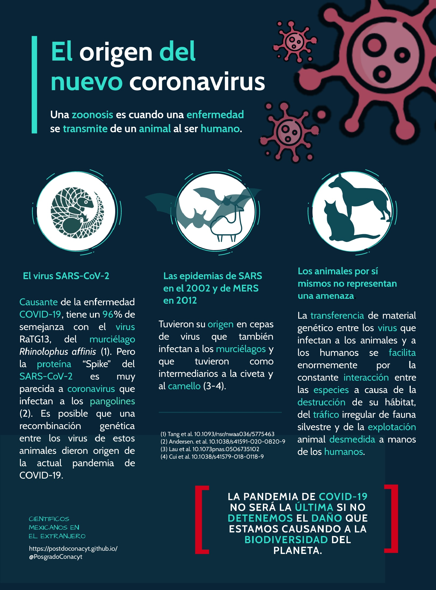

## El posible origen del SARS-CoV-2 es una zoonosis

Las zoonosis son un grupo de enfermedades que se transmiten de los animales a los seres humanos. El mayor riesgo de transmisión de enfermedades zoonóticas se produce en la interfaz entre el ser humano y los animales a través de la exposición directa o indirecta a los animales, los productos derivados de estos (carne, leche, huevos, etc) o su entorno.

Según el Programa de Naciones Unidas para el Medio Ambiente, el 60% de las enfermedades infecciosas humanas tiene origen animal. Este porcentaje alcanza el 75% en el caso de las enfermedades llamadas “emergentes”, por ejemplos: ébola, VIH, gripes aviarias, SRAS, zika y ahora el Covid-19.

El virus SARS-CoV-2, causante de la enfermedad COVID-19, tiene un 96% de semejanza con el virus RaTG13, que infecta a la especie de murciélago Rhinolophus affinis. Esta no sería la primera vez que una enfermedad causada por un virus de la familia de los coronavirus ocurre a través de transferencia zoonótica. Las epidemias de SARS en el 2002 y de MERS en 2012, tuvieron su origen en cepas de virus que también infectan a los murciélagos y que usaron como intermediarios a otros animales como la civeta y al camello.

La emergencia de enfermedades zoonóticas se facilita enormemente por la constante interacción entre las especies y el desequilibrio de su entorno, lo que causa “puentes” para llegar a los humanos. Esta interacción está mediada entre otras cosas por la destrucción de su hábitat (deforestación, agricultura, urbanización), el tráfico irregular de fauna silvestre y la explotación animal desmedida.

La emergencia de enfermedades zoonóticas se facilita enormemente por la constante interacción entre las especies y el desequilibrio de su entorno, lo que causa “puentes” para llegar a los humanos. Esta interacción está mediada entre otras cosas por la destrucción de su hábitat (deforestación, agricultura, urbanización), el tráfico irregular de fauna silvestre y la explotación animal desmedida.

LA PANDEMIA DE COVID-19 NO SERÁ LA ÚLTIMA SI NO DETENEMOS EL DAÑO QUE ESTAMOS CAUSANDO A LA BIODIVERSIDAD DEL PLANETA.

